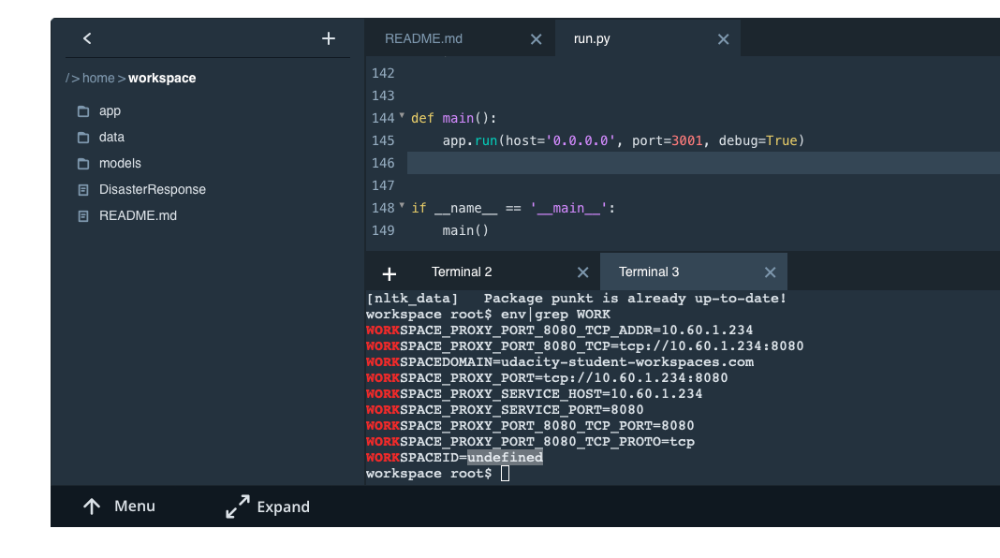

# Disaster Response Pipeline Project

Summary: the projects aims to create an algorithm to identify messages that are relevant for disaster responders. First, it loads and cleans raw messages from csv files and then saves proceessed messages into the SQL database. Next, it loads the processed data and used RandomForest clasifier to train a model predicting if messages are relevant for disaster responders.

### Instructions:
1. Run the following commands in the project's root directory to set up your database and model.

    - To run ETL pipeline that cleans data (from the two csv files) and stores in database (the name is provided by the user)
        `python data/process_data.py data/disaster_messages.csv data/disaster_categories.csv data/DisasterResponse.db`
    - To run ML pipeline that trains classifier and saves (passing the location of process data and destination of the trained model)
        `python models/train_classifier.py data/DisasterResponse.db models/classifier.pkl`

2. Run the following command in the app's directory to run your web app.
    `python app/run.py`

3. Go to http://0.0.0.0:3001/

### Explanation of Files

1. process_data.py runs ETL pipeline: loads data from csv file, cleans it and saves the selected information into the SQL database.
2. train_classifier.py runs ML pipeline, loads previously cleaned data, trains a model to predict category of the disaster related message using random forest classifier.
3. run.py is a flask application that generates the landing page of the project, shows descriptive charts and allows to test a message using the trained model.
4. go.html and master.htl are htl scripts that are used by run.py app to generate the landing page of the project.

Note for reviewer. When I am trying to check the app in the Udacity terminal it returns that WORKSPACEID=udentified so I cannot check the front-end.

